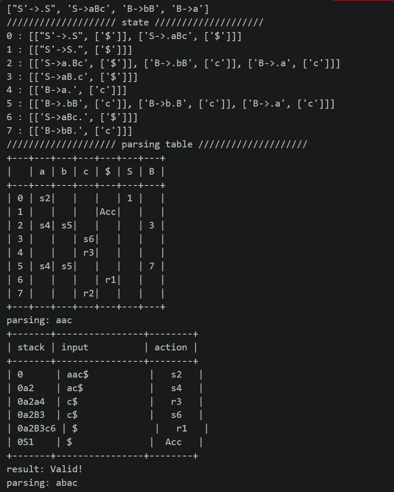

# LR(1) Syntax Parser (語法分析器)

## Introduction
本專案為編譯器前端 (Compiler Front-end) 之核心實作。系統能動態讀取 Context-Free Grammar (CFG)，自動推導並建構 LR(1) 狀態機 (State Machine)，最終生成具備 Lookahead 能力的 Parsing Table (Action & Goto 表)。

系統能利用生成的分析表，精準模擬編譯器底層的 Shift 與 Reduce 堆疊操作，判斷輸入之測資字串是否符合定義之語法規範。

[完整題目](./1141_compiler.pdf)

## Demo
系統會詳細印出狀態機生成結果、Parsing Table，以及每一筆測試字串的推導過程。

## System Architecture
系統主要拆分為以下五大核心模組：

1. **Grammar 載入與 Token 化：** 讀取文法並轉換為內部資料結構，精確切割終結與非終結符號。
2. **$FIRST$ 集合計算：** 運用迭代演算法計算所有符號（含字串）之 $FIRST$ 集合，以支援 Lookahead 預測。
3. **LR(1) Closure 與 GoTo 計算：** 處理狀態內與狀態間的項目集擴展與轉移。
4. **Canonical Collection 建構與解析表生成：** 建立完整的 LR(1) DFA 並映射至 ACTION/GOTO 表格。
5. **輸入字串解析 (Parsing)：** 實作底層 Stack 運作邏輯，執行即時語法驗證。

## Core Algorithms

### 1. 嚴謹的詞法拆解 (Tokenization)
* `tokenize_rhs`: 在處理 Production 右側字串時，系統採用**依長度排序、長符號優先匹配**的貪婪策略。這能有效避免如將識別字 `"id"` 誤拆分為 `"i"` 與 `"d"` 的邊界錯誤，確保長符號的完整性。

### 2. $FIRST$ 集合與 $\epsilon$ (Epsilon) 處理
* `compute_first_sets`: 利用迭代法持續更新 $FIRST$ 集合直到收斂。特別針對 $\epsilon$ 進行處理：若 Production Body 內所有符號皆能推導出 $\epsilon$，則將 $\epsilon$ 加入該 Head 的 $FIRST$ 集合中。
* `first_of_string`: 用於 Closure 計算時推導 Lookahead 集合。若遍歷符號串時遇到無法導出 $\epsilon$ 的符號則立即中斷，確保 Lookahead 的精確度。

### 3. LR(1) 狀態機建構 (State Machine Generation)
* `closure`: 為了避免狀態內產生冗餘項目，實作了 `closure_map` 來**將具備相同核心項目 (Core Item) 的 Lookahead 進行合併**。
* `build_lr1_automaton`: 採用**廣度優先搜尋 (BFS)** 確保所有可達狀態 (Reachable States) 皆被完整遍歷。同時，透過對 `goto_symbols` 進行字母排序，保證了 DFA 遍歷順序與生成的穩定性。

### 4. 語法解析模擬 (Shift-Reduce Parsing)
* `parse_string`: 完整實作標準 LR(1) 演算法。透過維護一個狀態 Stack，動態查詢 ACTION 表進行 `Shift` (推入符號與狀態) 或 `Reduce` (彈出對應長度的元素並透過 GOTO 決定新狀態) 操作，並能即時印出每一步的推導過程以利 Debug。

## Error Handling
系統具備嚴格的語法檢驗機制：
*   **Invalid Character Rejection：** 若輸入字串包含未定義於 `terminal` 列表之字元（如輸入 `aca` 但 `c` 未定義），系統會立即中斷並拋出 `Invalid character exist!` 錯誤。
*   **Syntax Error Detection：** 遇無法匹配 Parsing Table 的非法語法結構時，精準判定為 `Invalid!`。

## Source Code
[完整程式碼](./parser/parser.py)
